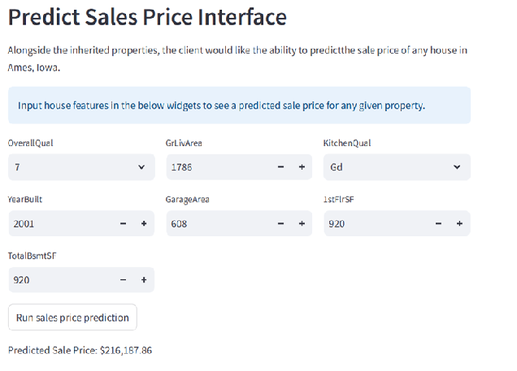

# Heritage Housing Issues - Data Analytics Milestone Project

## Project Overview

Heritage Housing Issues is a milestone project for the Predictive Analytics unit of Code Institute's Diploma in Full Stack Web Development.

Please follow this link to see the live app deployed to Heroku: [Heritage Housing Issues](https://heritage-housing-issues-239a4c7258f3.herokuapp.com/)

The purpose of this project is to build a Data App with a Machine Learning User Interface (UI) combining: (1) Python packages for Machine Learning, Data Analysis and Data Visualisations; and (2) Streamlit for fast Machine Learning prototyping. This project allows the user to perform critical data analysis to generate useful insights, and deliver data-driven recommendations.

## Project Planning

The project has been planned using Agile methodology, mapping business requirements in a user story-based format, through GitHub's project planner. Please follow this link to the [project board](https://github.com/users/Rob-C-89/projects/18).

The CRISP-DM methodology has been followed to inform and guide the project from beginning to deployment. It is an
industry-standard framework for data science projects. The 6 core phases for the workflow are:

1. Business understanding
2. Data understanding
3. Data perparation
4. Modelling
5. Evaluation
6. Deployment

The CRISP-DM (Cross-Industry Standard Process for Data Mining) workflow is flexible and highly iterative, and covers all steps necessary to produce scientific results. More can be read about it in this [Data Science PM](https://www.datascience-pm.com/crisp-dm-2/) article.

The business requirements have been mapped using these phases in the ['Rationales to map the business requirements to the Data Visualisations and ML tasks'](#rationales-to-map-the-business-requirements-to-the-data-visualisations-and-ml-tasks) section of this ReadMe file. Please note, since BR1 does not require modelling, this phase has been skipped, whereas the rationale for BR2 has this step included.

## Dataset Content

* The dataset is sourced from [Kaggle](https://www.kaggle.com/codeinstitute/housing-prices-data).
* The dataset has almost 1.5 thousand rows and represents housing records from Ames, Iowa, indicating house profile (Floor Area, Basement, Garage, Kitchen, Lot, Porch, Wood Deck, Year Built) and its respective sale price for houses built between 1872 and 2010.

|Variable|Meaning|Units|
|:----|:----|:----|
|1stFlrSF|First Floor square feet|334 - 4692|
|2ndFlrSF|Second-floor square feet|0 - 2065|
|BedroomAbvGr|Bedrooms above grade (does NOT include basement bedrooms)|0 - 8|
|BsmtExposure|Refers to walkout or garden level walls|Gd: Good Exposure; Av: Average Exposure; Mn: Minimum Exposure; No: No Exposure; None: No Basement|
|BsmtFinType1|Rating of basement finished area|GLQ: Good Living Quarters; ALQ: Average Living Quarters; BLQ: Below Average Living Quarters; Rec: Average Rec Room; LwQ: Low Quality; Unf: Unfinshed; None: No Basement|
|BsmtFinSF1|Type 1 finished square feet|0 - 5644|
|BsmtUnfSF|Unfinished square feet of basement area|0 - 2336|
|TotalBsmtSF|Total square feet of basement area|0 - 6110|
|GarageArea|Size of garage in square feet|0 - 1418|
|GarageFinish|Interior finish of the garage|Fin: Finished; RFn: Rough Finished; Unf: Unfinished; None: No Garage|
|GarageYrBlt|Year garage was built|1900 - 2010|
|GrLivArea|Above grade (ground) living area square feet|334 - 5642|
|KitchenQual|Kitchen quality|Ex: Excellent; Gd: Good; TA: Typical/Average; Fa: Fair; Po: Poor|
|LotArea|Lot size in square feet|1300 - 215245|
|LotFrontage|Linear feet of street connected to property|21 - 313|
|MasVnrArea|Masonry veneer area in square feet|0 - 1600|
|EnclosedPorch|Enclosed porch area in square feet|0 - 286|
|OpenPorchSF|Open porch area in square feet|0 - 547|
|OverallCond|Rates the overall condition of the house|10: Very Excellent; 9: Excellent; 8: Very Good; 7: Good; 6: Above Average; 5: Average; 4: Below Average; 3: Fair; 2: Poor; 1: Very Poor|
|OverallQual|Rates the overall material and finish of the house|10: Very Excellent; 9: Excellent; 8: Very Good; 7: Good; 6: Above Average; 5: Average; 4: Below Average; 3: Fair; 2: Poor; 1: Very Poor|
|WoodDeckSF|Wood deck area in square feet|0 - 736|
|YearBuilt|Original construction date|1872 - 2010|
|YearRemodAdd|Remodel date (same as construction date if no remodelling or additions)|1950 - 2010|
|SalePrice|Sale Price|34900 - 755000|

## Business Requirements

As a good friend, you are requested by your friend, who has received an inheritance from a deceased great-grandfather located in Ames, Iowa, to  help in maximising the sales price for the inherited properties.

Although your friend has an excellent understanding of property prices in her own state and residential area, she fears that basing her estimates for property worth on her current knowledge might lead to inaccurate appraisals. What makes a house desirable and valuable where she comes from might not be the same in Ames, Iowa. She found a public dataset with house prices for Ames, Iowa, and will provide you with that.

### Business Requirement 1 (BR1)

The client is interested in discovering how the house attributes correlate with the sale price. Therefore, the client expects data visualisations of the correlated variables against the sale price to show that.

### Business Requirement 2 (BR2)

The client is interested in predicting the house sale price from her four inherited houses and any other house in Ames, Iowa.

## Hypotheses and Validation

### Hypothesis 1 - House attributes correlate with Sale Price

**Statement:**
Certain attributes are expected to show a measurable positive correlation with Sale Price.

**Validation Approach:**

* Compute Spearman correlation coefficients between all house attributes and Sale Price.
* Produce a correlation heatmap to identify the strongest relationships at a glance.
* Generate scatter plots of the highest-correlated continuous variables against Sale Price.
* Hypothesis is confirmed if key attributes show a statistically significant correlation with Sale Price.

### Hypothesis 2 - House attributes can be used to predict Sale Price

**Statement:**
A machine learning regression model trained on the Ames housing dataset will accurately predict Sale Price, using the most correlated features as inputs.

**Validation Approach:**

* Select features based on findings from Hypothesis 1 correlation analysis.
* Split the Ames dataset into training and test sets to evaluate model generalisation
* Train and compare regression models.
* Evaluate model performance using R² (target ≥ 0.75) and RMSE as primary metrics.
* Apply the final model to predict Sale Price for the four inherited properties.
* Hypothesis is confirmed if the model achieves the R² target on unseen test data, demonstrating reliable predictive power beyond a simple baseline mean estimate.

## Rationales to map the business requirements to the Data Visualisations and ML tasks

### Business Requirement 1 — Correlation & Visualisation

**Requirement:** The client wants to understand how house attributes correlate with Sale Price in Ames, Iowa, presented through data visualisations.

**Rationale:** The client has strong property knowledge in her home region but lacks familiarity with the Ames, Iowa market. Visualising which attributes most strongly drive Sale Price in this specific dataset allows her to make informed, evidence-based decisions about how to present and position her inherited properties for sale, rather than relying on assumptions from another market.

| CRISP-DM Phase | Tasks |
| --- | --- |
| **Business Understanding** | Define correlation analysis and data visualisation as the goal for BR1. |
| **Data Understanding** | Collect data, and explore distributions and relationships between house attributes and Sale Price. |
| **Data Preparation** | Clean, encode and normalise data as necessary. |
| **Evaluation** | Confirm Hypothesis 1 via statistically significant correlation coefficients. |
| **Deployment** | Present correlation heatmaps and scatter plots to the client as visual deliverables. |

### Business Requirement 2 - Sale Price prediction

**Requirement:** The client wants to predict the sale price of her four inherited properties and any other house in Ames, Iowa.

**Rationale:** Correlation analysis identifies relationships but cannot produce a price estimate. A trained regression model provides an objective, data-driven prediction, giving the client a reliable basis for pricing decisions.

| CRISP-DM Phase | Task |
| --- | --- |
| **Business Understanding** | Define Sale Price prediction as the analytical goal for BR2. |
| **Data Understanding** | Identify most correlated features from BR1 to inform feature selection. |
| **Data Preparation** | Handle missing values, encode categorical variables, engineer features as required. |
| **Modelling** | Train and compare regression models (e.g. Linear Regression, Random Forest, Gradient Boosting) |
| **Evaluation** | Assess model performance using R² (target ≥ 0.75) and RMSE on unseen test data; confirm Hypothesis 2 |
| **Deployment** | Apply final model to predict Sale Price for the four inherited properties and deliver an interactive prediction interface |

## ML Business Case

### Predict house Sale Price

**Regression Model:**

* We want an ML model to predict the Sale Price of residential properties in Ames, Iowa, based on historical house sale data. The target variable is continuous and numerical. We consider a regression model. It is a supervised model with a single continuous output: the predicted Sale Price in US dollars.

* Our ideal outcome is to provide the client with a reliable, data-driven predicted Sale Price for each of her four inherited properties.

* The model's success metrics are as follows:
  * At least R² score of 0.75 on both train and test sets
  * The ML model is considered a failure if:
    * R² score falls below 0.75 on the test set, indicating the model does not generalise reliably to unseen Ames properties.

* The model output is defined as a predicted Sale Price in US dollars for any given property in Ames, Iowa. The client will input house attributes via an interactive interface (Streamlit dashboard) and receive a live predicted Sale Price for a single property
* The four inherited properties will be predicted as a batch at the point of delivery.

* Regarding heuristics, the client currently has no approach to estimate Sale Price in Ames, Iowa.

* The training data to fit the model comes from the Ames Housing Dataset, which contains approximately 1,500 house sale records. The data will be inspected and cleaned, with feature engineering steps to prepare it fo the model.

## Dashboard Design (Streamlit App User Interface)

### Page 1: Quick project summary

This page will provide a quick project summary:

* Project Terms & Jargon
* Describe Project Dataset, including a link to the dataset source
* State Business Requirements

### Page 2: Correlation Study and Visualisation

This page will answer business requirement 1:

* State BR1
* Checkbox: data inspection on house attributes and sale value, (display the number of rows and columns in the data, and display the first ten rows of the data)
* Display the most correlated variables to sale price and the conclusions
* Checkbox: Heatmap of sale price and related variables.
* Checkbox: Scatter plots of sale price and related variables.

### Page 3: House Sale Price Predictor

This page will answer business requirement 2:

* State BR2
* Inherited properties predictions:
* Display a table of the four inherited properties with their attributes
* Display the predicted Sale Price for each inherited property
* Display the total combined predicted Sale Price for all four properties
* Interactive house Sale Price predictor:
  * Set of widgets inputs relating to house attributes. Each set of inputs is related to a given ML task to predict sale price.
  * Display predicted house sale price

### Page 4: Project Hypothesis and Validation

This page will state the hypotheses and validation of the project:

* State hypothesis 1 and 2.
* State validation approach for each hyothesis.
* Confirmation status for each hypothesis.

### Page 5: ML Model Performance

* Data preparation notes
* Considerations and conclusions after the pipeline is trained
* Present ML pipeline steps
* Feature importance
* Model performance: R² and RMSE on train and test sets
* Predicted vs Actual Sale Price plot
* Confirmation of whether R² ≥ 0.75 target was achieved

## Testing

Manual testing has been carried out to ensure all dashboard features and business-related requirements are working correctly.

| Test | Page | Action | Expected Result | Pass/Fail |
| --- | --- | --- | --- | --- |
| Navigation functional | All pages | Click each page in sidebar | Page loads without error | PASS |
| Project summary displays | Page 1 | Load page | Terms, dataset description and business requirements visible | PASS |
| Data inspection checkbox | Page 2 | Tick checkbox | Dataset dimensions and first 10 rows displayed | PASS |
| Correlation heatmap checkbox | Page 2 | Load page | Heatmap of top correlated features displayed | PASS |
| Scatter plots checkbox | Page 2 | Tick checkbox | Scatter plots of top features vs Sale Price displayed | PASS |
| Box plots checkbox | Page 2 | Tick checkbox | Box plots of categorical features vs Sale Price displayed | PASS |
| Inherited properties table | Page 3 | Load page | Table of four inherited properties with attributes displayed | PASS |
| Inherited predictions display | Page 3 | Load page | Predicted Sale Price shown for each inherited property | PASS |
| Total Sale Price display | Page 3 | Load page | Combined total Sale Price displayed | PASS |
| Interactive predictor | Page 3 | Input house attributes | Predicted Sale Price returned | PASS |
| Hypothesis 1 display | Page 4 | Load page | Hypothesis 1 statement and validation conclusions visible | PASS |
| Hypothesis 2 display | Page 4 | Load page | Hypothesis 2 statement and validation conclusions visible | PASS |
| Pipeline steps display | Page 5 | Load page | ML pipeline steps clearly listed | PASS |
| Feature importance plot | Page 5 | Load page | Feature importance bar chart displayed | PASS |
| Model performance table | Page 5 | Load page | R², MAE, MSE and RMSE shown for train and test sets | PASS |
| Predicted vs Actual plot | Page 5 | Load page | Scatter plots for train and test sets displayed | PASS |

## Manual testing of model performance

The first house was taken from the data set and ran through the Sale Price Predictor in the dashboard. The result is displayed below. The model returned a predicted sale price of $216,187.86, against a real-life saleprice of $223,500. This is an error of 3.27%, which is very acceptable indeed.

| Feature | Value |
| --- | --- |
| OverallQual | 7 |
| GrLivArea | 1786 |
| KitchenQual | Gd |
| YearBuilt | 2001 |
| GarageArea | 608 |
| 1stFlrSF | 920 |
| TotalBsmtSF | 920 |
| SalePrice | 223,500 |
| **Model predicted price** | **216,187.86** |

## Bugs & Issues

* When running the Jupyter notebooks, the plots sometimes showed and sometimes did not show, despite the code being sound. %matplotlib inline was included at the top of each file to fix this issue.

## Deployment

### Heroku

* The App live link is: [Heritage Housing Issues](https://heritage-housing-issues-239a4c7258f3.herokuapp.com/)
* Set the .python-version Python version to a [Heroku-24](https://devcenter.heroku.com/articles/python-support#supported-runtimes) stack currently supported version.
* The project was deployed to Heroku using the following steps.

1. Log in to Heroku and create an App
2. At the Deploy tab, select GitHub as the deployment method.
3. Select your repository name and click Search. Once it is found, click Connect.
4. Select the branch you want to deploy, then click Deploy Branch.
5. The deployment process should happen smoothly if all deployment files are fully functional. Click the button Open App on the top of the page to access your App.
6. If the slug size is too large then add large files not required for the app to the .slugignore file.

## Main Data Analysis and Machine Learning Libraries

| Library | Version | Usage |
| --- | --- | --- |
| **numpy** | 1.26.1 | Array computing and mathematical functions |
| **pandas** | 2.1.1 | Extensively used for data manipulation and analysis |
| **matplotlib** | 3.8.0 | Plotting graphs for data visualisation |
| **seaborn** | 0.13.2 | Correlation heatmaps, scatter and box plots |
| **plotly** | 5.17.0 | Interactive scatterplot for data visualisation |
| **streamlit** | 1.40.2 | Interactive dashboard for delivering project |
| **feature-engine** | 1.6.1 | Imputation and encoding in pipelines |
| **imbalanced-learn** | 0.11.0 | Handling imbalanced datasets |
| **ydata-profiling** | 4.12.0 | Generating profile reports for data exploration |
| **scikit-learn** | 1.3.1 | ML pipeline, feature selection and model evaluation |
| **xgboost** | 1.7.6 | XGBoost regressor compared during model search |

## Credits

* The dataset was sourced from [Kaggle](https://www.kaggle.com/codeinstitute/housing-prices-data)

* The [template](https://github.com/Code-Institute-Solutions/milestone-project-heritage-housing-issues) for the repository was supplied by Code Institute.

* [Code Institute's](https://codeinstitute.net/global/) Churnometer walk-through project was used in many cases for guidance and in some cases direct supply of code. These have been referenced in the source code comments and include:
  * The template for the Jupyter notebooks.
  * ReadMe template.
  * In Jupyter notebook 05 - Modelling, large blocks of code were taken directly for:
    * Custom Class for hyperparameter optimisation
    * Assess Feature Importance
    * Evaluate on train and test sets
  * Class to generate multiple Streamlit pages using an object oriented approach

* Code to display outliers was taken and modified from Feature Engine Unit 6 of Code Institute's Full Stack program

* [Claude AI](https://claude.ai/) by Anthropic was used for debugging and explanation of concepts.
  
* [Stack Edit](https://stackedit.io/) used for markdown editing and table creation.
* The following websites were particularly helpful:
  * [Scikit-learn](https://scikit-learn.org/)
  * [Medium](https://medium.com)
  * [Towards Data Science](https://towardsdatascience.com/)

## Acknowledgements

* Thanks to CI mentor Iuliia Konovalova for her guidance on this project.
